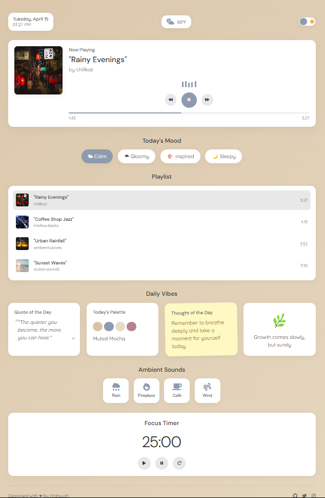

# Mikujin 🎵

## Your Personalized Ambient Experience

Mikujin is a sleek, intuitive UI concept for a music dashboard that adapts to your emotional state, providing the perfect visual environment for any mood. This is a frontend UI implementation showcasing interactive design elements and theme customization.

## Features

- 🌓 Seamless dark/light mode switching with saved preferences
- 🎭 Mood-based themes (calm, gloomy, inspired, sleepy)
- 🕰️ Real-time clock and date display
- 🎧 Interactive playlist with album artwork
- 🔊 Ambient sound mixer for customized soundscapes
- ⏱️ Focus timer options for productivity
- 📊 Visual progress tracking

## How to Use
1. Select your preferred theme and mood setting
2. Choose a track from the curated playlist
3. Mix in ambient sounds to enhance your experience
4. Set a timer for focused work or relaxation
5. Enjoy your personalized audio environment

## Technologies Used

- HTML5
- CSS3
- Vanilla JavaScript
- Local Storage API

## Preview

## Try It Out

Visit [Mikujin](https://pratyush1120.github.io/mikujin/) to start focusing with your new cute companion!

Note
This is a UI implementation only. The audio playback and timer functionality are simulated for demonstration purposes.

## About

Made with ❤️ by Pratyush.